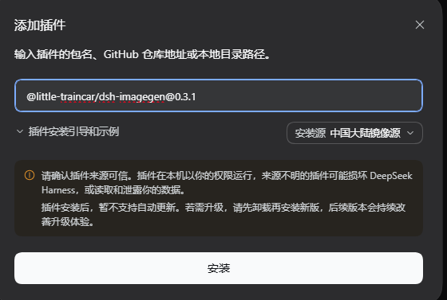

# dsh-imagegen

[English](README.md) | [简体中文](README.zh.md)

Image generation plugin for DeepSeek Harness. Registers the `generate_image` tool so the agent can create images and show them inline in the conversation.

## Features

- **Inline images** — generated images are attached to the conversation and render directly in chat (plus a same-origin `/imagegen/<file>` link as a fallback).
- **User-configurable model** — every channel's model id is yours to fill in, in Settings. Aliases and per-call overrides included.
- **Open provider table** — built-in Doubao Seedream and Aliyun qwen, plus any OpenAI-compatible `/images/generations` endpoint: gateways, relays, or local deployments (Ollama / vLLM / SD-WebUI / ComfyUI).
- **Watermark-free** — `watermark: false` is sent by default; the switch exists for the models that reject the field.
- **Verbatim in-image text** — text you supply is embedded character by character, never reworded.
- **Image-to-image** — pass a reference image (URL, absolute local path, or data URI) and describe the change.
- **Saved to disk** — every image is written to `outDir` before it is returned.
- **Several candidates in one call** — channels that declare `supportsN` produce multiple images from a single request.
- **Partial failures survive** — if some of the requested images fail, the successful ones are kept and the failures are listed.
- **Requires DSH 0.2.x** (0.2.0-rc.2 / 0.2.1-alpha.1).

## Installation

### Desktop

Launch Desktop once so it creates its profile, then **fully quit the application** before running the command.

```powershell
dsh plugin --profile desktop add @little-traincar/dsh-imagegen
```

Reopen Desktop to load it.



### Web

```powershell
dsh plugin --profile web add @little-traincar/dsh-imagegen
```

Restart the web profile to load it.

### From GitHub (a specific tag)

```powershell
dsh plugin --profile desktop add github:little-traincar/dsh-imagegen#v0.3.1
```

### From a local checkout or tarball

```powershell
dsh plugin --profile desktop add ./
dsh plugin --profile desktop add ./little-traincar-dsh-imagegen-0.3.1.tgz
```

## Configuration

Open **Settings → imagegen**, fill in an API key for the channel you want to use, then save. Settings are written to the profile's `cordis.patch.yml` and take effect on the next generation call — no restart.

### Built-in providers

| Channel | Default model | API key |
|---|---|---|
| `doubao` | `doubao-seedream-5-0-pro-260628` | Volcengine Ark console, or env `ARK_API_KEY` |
| `qwen` | `qwen-image-3.0-pro` | Alibaba Bailian / DashScope console, or env `DASHSCOPE_API_KEY` |
| your own | you choose | see Custom providers |

### Custom providers

Any OpenAI-style `POST <baseUrl>/images/generations` works. Declare it in the **Custom providers** field:

```json
{
  "local": {
    "baseUrl": "http://127.0.0.1:11434/v1",
    "model": "x/flux2-klein",
    "apiKeyOptional": true,
    "sendWatermark": false,
    "sendPromptExtend": false,
    "size": "1024x1024"
  }
}
```

| Field | Default | Meaning |
|---|---|---|
| `baseUrl` | required | bare host gets `/v1/images/generations`; a `/v1` suffix gets `/images/generations` |
| `model` | required | fallback model id for this channel |
| `apiKey` / `apiKeyEnv` | empty | inline key, or read from an environment variable (fallback `IMAGE_API_KEY` / `OPENAI_API_KEY`) |
| `apiKeyOptional` | false | keyless endpoints (local deployments) must opt in |
| `authHeader` / `authScheme` | `authorization` / `Bearer ` | auth header name and prefix |
| `size` / `sizes` | 1024x1024 tier | fixed size, or a per-aspect table |
| `sizeSeparator` | `x` | `*` for Alibaba-style sizes |
| `supportsN` / `maxN` | false / 4 | several images in one request |
| `sendWatermark` | true | set false for models that reject `watermark` |
| `sendN` / `sendSeed` / `sendNegativePrompt` | true | turn off parameters a model rejects |
| `sendPromptExtend` | false | true sends `prompt_extend:false` |
| `imageField` | `image` | reference-image field; `false` disables image-to-image |
| `responseFormat` | `b64_json` | or `url` |
| `extraBody` | empty | vendor-private fields |

### Models

Each channel's model id is editable, in three places:

1. **Settings → imagegen → Models** — one model-id field per channel. Saving it empty clears the override and restores the built-in default.
2. **Model details** (or `cordis.patch.yml`) — the whole map at once, with optional aliases:

```json
{
  "doubao": "doubao-seedream-5-0-pro-260628",
  "qwen": "qwen-image-3.0-pro",
  "relay/gpt-image": { "id": "gpt-image-1", "label": "Gateway GPT-Image" }
}
```

A key is either `<channel>` (that channel's default model) or `<channel>/<alias>`. An alias can be named in a tool call:

```
generate_image(prompt="…", provider="relay", model="gpt-image")
```

Any other `model` value is passed through verbatim as a model id. The result reports the `provider` and `model` actually used.

## Usage

Ask for an image in the conversation — for example: “Draw a summer coffee-shop poster: retro magazine collage, cream yellow and coffee brown, portrait; headline ‘Summer Ice Cafe Festival’, subtitle ‘Half price for the second cup’.”

The agent calls `generate_image` and the images appear inline. Every image is also written to `outDir` (default: `generated-images` under the directory dsh was started in).

## Uninstallation

### Desktop

Fully quit the application first, then:

```powershell
dsh plugin --profile desktop remove @little-traincar/dsh-imagegen
```

### Web

```powershell
dsh plugin --profile web remove @little-traincar/dsh-imagegen
```

The command removes the bundle from the profile and uninstalls the package; restart the profile to finish unloading it. Generated images under `outDir` and the `imagegen` section of the profile's `cordis.patch.yml` are left in place — delete them yourself if you want a clean sweep.

## License

MIT
